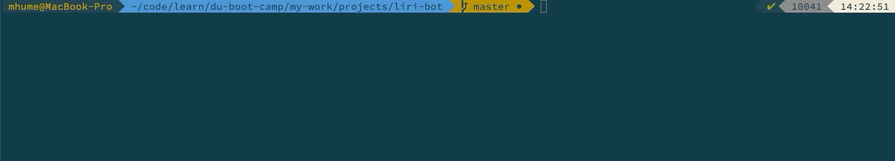
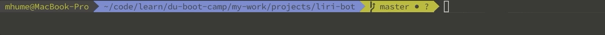
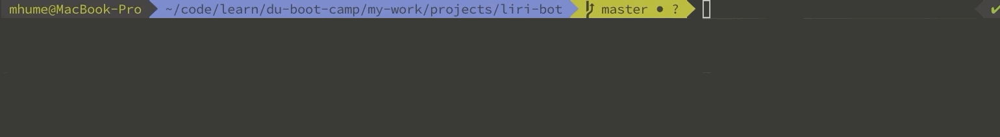

# Liri-bot

## About
CLI application that returns the following API results:
- Concerts via the "Bands in Town" API
- Songs via the "Spotify" API
- Movies via the "omdb" API

## Getting Started
1. Begin by typing the following code into the command line:
```
node liri.js
```
*When the app is used without any arguments a suggestion appears.*


2. The first argument provided after `node liri.js` will be a `<command>`.
```
node liri.js help
```
*This will display a list of acceptable commands*


3. The second argument provided after `node liri.js` will be a `<search parameter>` for the command. The following are the searchable categories.


#### Concerts
```
node liri.js concert-this + <Artist/Band name>
```


*If the artist is not touring, Liri-bot will notify you.*


#### Songs
```
node liri.js spotify-this-song + <Song Title>
```
*Hold command and click the URL for a hyperlink to a preview of the song*


#### Movies
```
node liri.js movie-this + <Movie Title>
```


*When a movie title is misspelled, Liri-bot will notify you.*



#### Text Files
```
node liri.js do-what-it-says
```
*Liri-bot will read text from an external file, parse the data, and search accordingly.*


## Built With
* Node.js
* npm packages
    * [axios](https://www.npmjs.com/package/axios)
    * [chalk](https://www.npmjs.com/package/chalk)
    * [dotenv](https://www.npmjs.com/package/dotenv)
    * [moment](https://www.npmjs.com/package/moment)
    * [node-spotify-api](https://www.npmjs.com/package/node-spotify-api)

## Author
[Mike Hume](https://mahume.github.io)