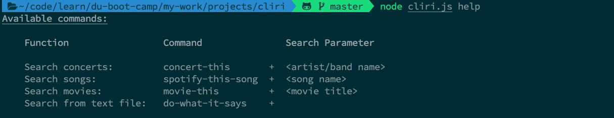
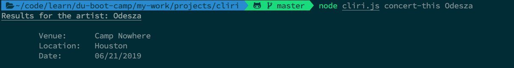
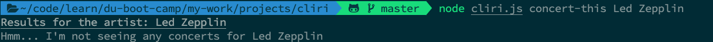
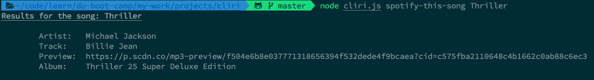
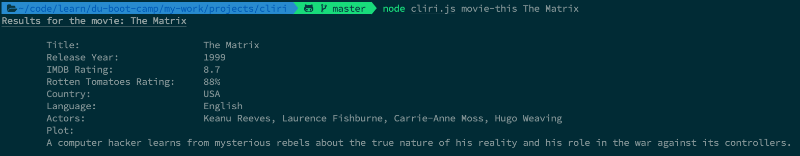
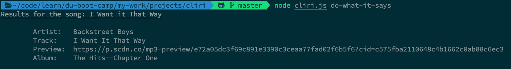

# Cliri

## About

Cliri (CLI + Siri) is a Command Line Interface application that returns the following API results:

- [Help](#help) Basic command to run the application
- [Concerts](#concerts) via the "Bands in Town" API
- [Songs](#songs) via the "Spotify" API
- [Movies](#movies) via the "omdb" API
- [Text Files](#text) via an external .txt file

## Getting Started

#### <a name="help"></a>Help

```
node cliri.js
```

*When the app is used without any arguments a suggestion appears.*


```
node cliri.js help
```

*This will display a list of acceptable commands*



The second argument provided after `node cliri.js` will be a `<search parameter>` for the command. The following are the searchable categories.


#### <a name="concerts"></a>Concerts

```
node cliri.js concert-this + <Artist/Band name>
```



*If the artist is not touring, Cliri will notify you.*



#### <a name="songs"></a>Songs

```
node cliri.js spotify-this-song + <Song Title>
```

*Hold command and click the URL for a hyperlink to a preview of the song*



#### <a name="movies"></a>Movies

```
node cliri.js movie-this + <Movie Title>
```



*When a movie title is misspelled, Cliri will notify you.*


#### <a name="text"></a>Text Files

```
node cliri.js do-what-it-says
```

*Cliri will read text from an external file, parse the data, and search accordingly.*


## Technologies

* Node.js
* npm packages
    * [axios](https://www.npmjs.com/package/axios)
    * [chalk](https://www.npmjs.com/package/chalk)
    * [dotenv](https://www.npmjs.com/package/dotenv)
    * [moment](https://www.npmjs.com/package/moment)
    * [node-spotify-api](https://www.npmjs.com/package/node-spotify-api)

## Author

[Mike Hume](https://mahume.github.io)